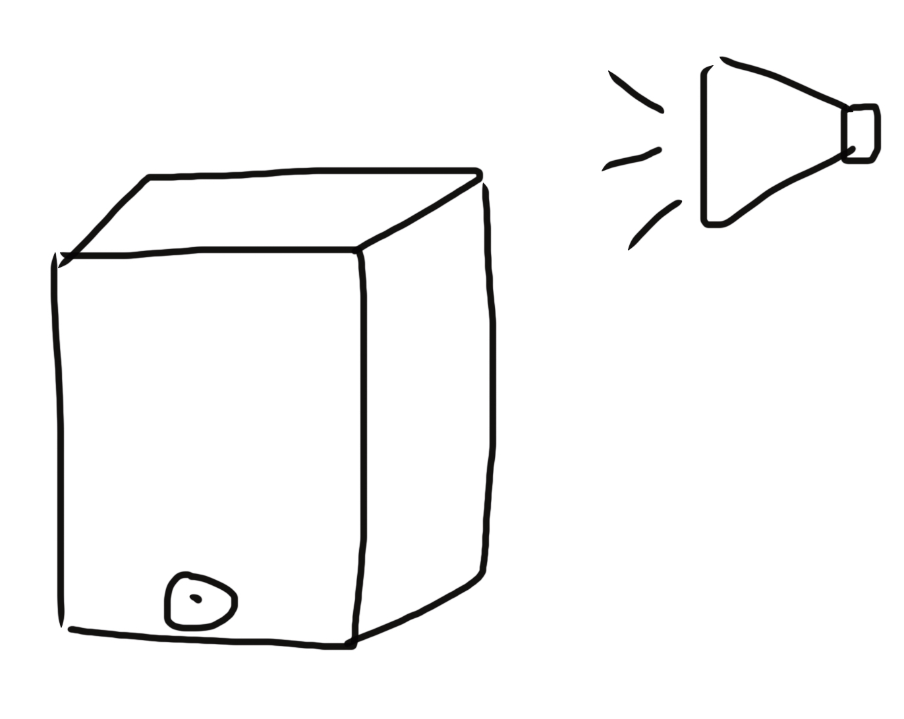

# TECHIN514_Project

`Diyun Lu 2430741`

### Sonic Flow - A Music Visualization Device

#### Overview

Sonic Flow senses the music around and visualize the waveform. The sensing device is responsible for detecting the music around. And the display device will display the corresponding waveforms together with a part acting as a monotrome to display the bpm.

 

#### Sensing Device

The sensing device is equipped with a microphone sensor, which is recording the sound waves and send it to display device. A bluetooth module of esp32 will handle this transmission, since in the application, these two devices should be very far, so I chose bluetooth. Also the sound level will affect the brightness of the LED strip around the cube, louder the sound is, brighter the LED is.

#### Display Device

The display device is mainly displaying the waveform and the bpm of the music detected. BPM is displayed through the stepper-motor-driven gauge needle as a monotrome. Further ML will be embedded on the microncontroller to detect the emotion of the music and also display it on the OLED. A design of different kinds of waveforms will be enabled by a button to switch between different designs.

#### Connection Diagram

The connection of the two parts are shown below. They connect with each other through ESP32's Bluetooth module. And ESP32 is responsible for the control of other sensors.

#### Device Composition

| Device          | Sensor / Element                                             | Functionality                     |
| --------------- | ------------------------------------------------------------ | --------------------------------- |
| Sensing         | SPH0645LM4H-B                                                | Microphone                        |
| Sensing         | 3.7V / ++?                                                   | Battery                           |
| Display         | 3.7V / ++?                                                   | Battery                           |
| Display         | SSD1305(Long, for waves),https://www.adafruit.com/product/292,Adafruit OLED FeatherWing(Small, for displaying bpm) | OLED                              |
| Display         | D6R90 F2 LFS                                                 | Button                            |
| Display/Sensing | RGB                                                          | LED                               |
| Display         | https://www.adafruit.com/product/2424                        | Stepper-motor-driven Gauge Needle |
|                 | ESP32                                                        | Bluetooth and control             |

